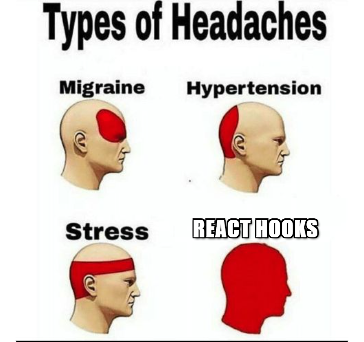

# Meme-Generator
Frontend Development, HTML, CSS, JavaScript and React

### Description
A small interactive meme generator web app built with React. The user can select a random meme image from an API and add custom text at the top and/or bottom. The text changes in real-time with every key-stroke, and can be freely dragged to any position on the image, both on desktop and mobile devices. It's responsive across different screen sizes, thanks to Flexbox, Grid and media queries.

The project focuses on:
* Handling dynamic UI interactions;
* Fetching and handling data from an external API in React;
* Implementing drag-and-drop functionality;
* Exporting HTML elements to images.

It is inspired by the [Scrimba Learn React course](https://scrimba.com/learn-react-c0e) I completed.

### Features
* Select a random meme image from an API;
* Add custom top and bottom text that updates with every key-stroke;
* Drag text freely on the image;
* Download the created meme as a *.png*.

### Tools
* React – functional components, hooks and props;
* CSS Flexbox, Grid & Media Queries – styling, layout and responsiveness;
* [Imgflip API](https://imgflip.com/api) - for fetching meme background images;
* HTML2Canvas - for exporting the meme as an image.

### Screenshots
**Desktop View**

**Mobile View**  

**Download**  

